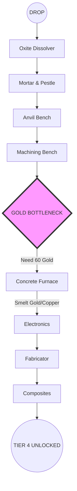

---

## 📑 TACTICAL NAVIGATION
| [🛠️ Workshop Meta](#-workshop-meta-loadout) | [🧬 Talent Builds](#-talent-builds-min-max) | [⛏️ Mining Secrets](#-advanced-mining--animation-canceling) | [🐻 The Bear Dance](#-combat-mastery-the-bear-dance) |
| :---: | :---: | :---: | :---: |

---

## 🛠️ WORKSHOP META (LOADOUT)
*Stop wasting Ren. This is the optimal drop kit.*

| ITEM | SLOT | PRIORITY | REASON |
| :--- | :--- | :---: | :--- |
| **MXC Pickaxe** | Tool | 🟥 CRITICAL | The only tool you need. Skips Stone/Iron/Steel tiers instantly. |
| **MXC Knife** | Weapon | 🟧 HIGH | Skinning speed = Fast Leveling. |
| **Hark & Sol "Suits"** | Armor | 🟨 MEDIUM | +5% Move Speed. Physical Resistance is irrelevant if you don't get hit. |
| **Module: Mass Dampener** | Suit Slot | 🟥 CRITICAL | **Movement Speed is King.** Running faster means higher Ren/Hour. |
| **Module: Advan. Bandage** | Suit Slot | 🟩 LOW | Prevents bleeding death if you mess up a bear fight. |

> **💎 EXOTIC FARMING TIP:** Do not bring a bow. Craft a `Longbow` on the planet immediately. It's cheap and better than low-tier workshop bows.

---

## 🧬 TALENT BUILDS (MIN-MAX)

Don't be a "Generalist". Pick a role or fail.

### 🏃‍♂️ THE SPEEDRUNNER (Solo Meta)
*Focus: Complete mission objectives in <15 mins.*
1.  **SURVIVAL TREE:**
    *   `Run Speed` (3/3)
    *   `Stamina Regen` (3/3)
    *   `Move Speed with Knife` (3/3)
2.  **HUNTING TREE:**
    *   `Chase 'Em Down` (+Speed after kill)
    *   `Highlight Animals` (Essential for spotting predators).

### 🏗️ THE ARCHITECT (Base Builder)
*Focus: Tier 4 Rush & Electronics.*
1.  **CONSTRUCTION TREE:**
    *   `Discount Wood/Stone` (Save thousands of resources).
    *   `Over-Encumbered Move Speed` (Carry the entire base).
2.  **SURVIVAL TREE:**
    *   `Carry Weight` (Max it out).

---

## ⛏️ ADVANCED MINING & ANIMATION CANCELING

**The "Pickaxe Swing Cancel" Technique:**
You can mine 30% faster by canceling the recoil animation.
1.  Click **Left Mouse** (Swing).
2.  The moment the pickaxe hits the rock (damage number appears)...
3.  Quickly tap **Right Click** (Aim) or switch slots.
4.  Swing again immediately.
*Result: You delete nodes in seconds.*

### 🗺️ ORE CHEATSHEET
| Ore | Best Location | Usage |
| :--- | :--- | :--- |
| **Gold** | Deep Caves (Tier 2+) | Electronics (Fabricator). **HOARD THIS.** |
| **Copper** | Entrance of Caves | Electronics components. |
| **Platinum** | Deep Arctic/Desert Caves | Advanced composites. |
| **Titanium** | Deepest Caves Only | End-game tools. |
| **Sulfur** | Everywhere | Gunpowder. Don't hoard until needed. |

---

## 🐻 COMBAT MASTERY: "THE BEAR DANCE"

Polar Bears are tanky. You cannot tank them. You must **Dance**.

**The Pattern:**
1.  **Charge:** Run directly AT the bear with a knife/spear.
2.  **Bait:** Just before it bites, sprint **PAST** it (through its side).
3.  **Turn & Stab:** The bear has a slow turn animation. Stab it in the head while it turns.
4.  **Repeat:** Run past -> Turn -> Stab -> Run past.

> **💀 CRITICAL:** If you run *away* (backwards), the bear will catch you. You must run *past* it.

---

## ⚡ TIER 4 TECHNOLOGY FLOWCHART
*The fastest route to the Fabricator.*

---

## 🌡️ BIOME SURVIVAL DATA

| BIOME | ARMOR | BUFF FOOD | THREAT |
| :--- | :--- | :--- | :--- |
| **FOREST** | Cloth/Fur | Berries | Storms (Lightning fires) |
| **DESERT** | Cloth | Watermelon | Heatstroke (Water consumption x3) |
| **ARCTIC** | Fur/Polar | Meat Pie | **Freeze Damage** (Death in 60s) |

---
*Authorized by Vanguard Command. Good hunting, Prospector.*
