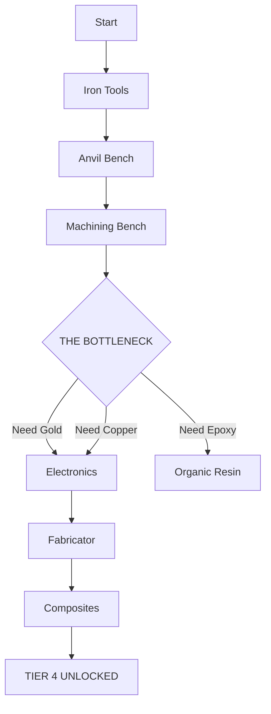

# 🚀 ICARUS: PROSPECTOR FIELD MANUAL

> **⚠️ SEVERITY:** EXTREME
> **MISSION:** EXTRACT EXOTICS. SURVIVE. LEAVE.

---

## 🛠️ ORBITAL WORKSHOP (THE META)
*Don't drop naked. Spend your Ren wisely.*

| Item | Slot | Cost | Why? |
| :--- | :--- | :--- | :--- |
| **MXC Pickaxe** | Tool | 💰 Low | Saves crafting a stone pick every drop. |
| **Naneo Armor** | Suit | 💰💰 Med | High durability + physical resistance. |
| **Mass Dampener** | Module | 💰💰💰 High | **Essential.** Increases movement speed. |
| **Canteen** | Water | 💰 Low | No more drinking from dirty ponds (Parasites). |

---

## ⚡ TIER 4 RUSH: THE ELECTRONICS BOTTLENECK

Getting to Tier 4 (Fabricator) is a grind. Follow this flow to avoid wasting resources.

> **🔥 PRO TIP:** **Gold** is the limiting factor. If you see a Gold node in a cave, MINE IT. Even if you are level 5. Store it. You will need hundreds later.

---

## ❄️ BIOME SURVIVAL CHART

| Biome | Major Threat | Required Resist | Weakness |
| :--- | :--- | :--- | :--- |
| **Forest** (Start) | Bears, Wolves | Physical | Fire (Don't burn your house down) |
| **Desert** | Heatstroke, Hyenas | Heat Resist | Water is scarce. Bring Canteen. |
| **Arctic** | **POLAR BEARS**, Freeze | Cold Resist | **Polar Bears have 3x HP.** Stealth is mandatory. |

---

## 🥩 FOOD BUFF SYNERGY (GASTRONOMY)
*Stop eating raw berries. Cooking = Stats.*

1.  **Stamina Focus (Mining/Running):**
    *   `Creamed Corn` (+Stamina Regen)
    *   `Fruit Salad` (+Max Stamina)
2.  **Health Focus (Combat/Bosses):**
    *   `Meat Pie` (+Max Health, +Health Regen)
    *   `Roasted Pumpkin` (Cheap Health buff)

---

## 📝 XP GRINDING LOOP (LEVEL 1-20 FAST)
1.  **Kill everything:** Wolves gave ~1500 XP.
2.  **Skinning:** Skinning gives separate XP from the kill.
3.  **Mining:** Hitting rocks gives XP.
4.  **Crafting:** Spam craft **Bandages** early game if you have excess fiber/cloth, then destroy them.

---
*Manual compiled by Veteran Prospector Il1v3y.*